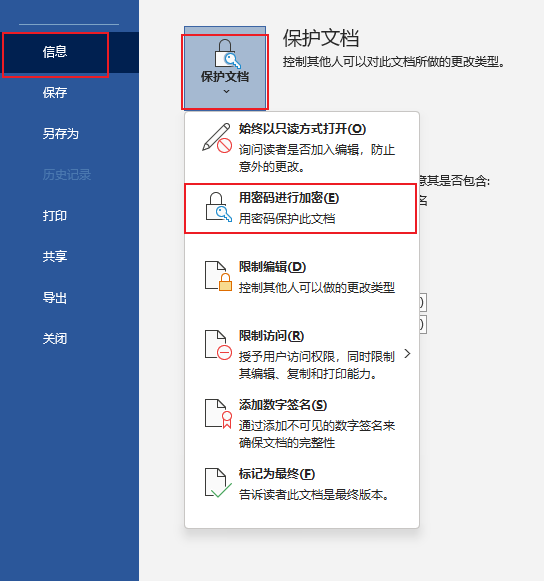

# Word文档

​		使用word文档可以方便地记录文本内容，并能够根据需要设置文字的样式，从而制作总结报告、租赁协议、请假条、邀请函、思想汇报等各类说明性文档。

## 1. 认识word工作界面

​		Word主要用于完成文字处理和文档编排工作，它主要由标题栏、功能区、快速访问工具栏、用户编辑区等部分构成，具体如下图：

| 序号 | 名称           | 功能                                                         |
| ---- | -------------- | ------------------------------------------------------------ |
| 1    | 快速访问工具栏 | 用于设置常用的按钮，如“撤销”、“保存”等。                     |
| 2    | 标题栏         | 用于显示当前文档的名称                                       |
| 3    | 窗口控制按钮   | 可对当前窗口进行最大化、最小化及关闭等操作，以及控制功能区的显示方式 |
| 4    | 选项卡         | 显示各个功能区的名称                                         |
| 5    | 功能区         | 包含大部分的功能按钮，并分组显示，方便用户使用               |
| 6    | 标尺           | 用于手动调整页边距或表格列宽等。                             |
| 7    | 用户编辑区     | 用于输入和编辑文档内容                                       |
| 8    | 状态栏         | 用于显示当前文档的信息                                       |
| 9    | 视图按钮       | 单击其中第一按钮可切换至相应的视图                           |
| 10   | 显示比例       | 用于更改当前文档的显示比例                                   |

> 使用小技巧：
>
> ​		我们在日常使用当中，可以在“视图”选项卡下的“显示”组中取消勾选“标尺”复选框，隐藏掉标尺。当我们需要使用的时候再去勾选即可。

## 2. Word的基本操作

### 2.1 插入日期和时间

​		日期和时间是我们经常会在文本里输入的数据之一，在word当中可以使用“日期和时间”对话框插入当前的日期和时间。

​		操作步骤：

​			（1）单击要插入日期和时间的位置

​			（2）点击“插入”选项卡，点击里面的“日期和时间”按钮，如下图：

​			（3）在新弹出的对话框当中，语言选择为“中文（中国）”，之后在左侧的可用格式当中选择需要的格式，之后点击下面的确定可以了。

​		当我们需要大量插入日期和时间的时候，我们还可以通过组合键快速的插入，如果想要插入的是系统当前的日期和时间，我们可以按[ Alt+Shift+D]组合键输入当前日期；按[ Alt + Shift + T ]组合键，输入当前时间。

### 2.2 输入符号

​		符号是具有某种特定意义的标识。能够直接从键盘输入的符号有限，我们可以通过“符号”对话框输入各种各样的符号。

​		我们在“插入”选项卡，单击“符号”按钮，在展开的列表中选择“其他符号”选项，如下图所示，之后会弹出一个“符号对话框”。

​		我们在这个对话框当中可以选择字体并且在下面的符号当中进行选择，如果这里并没有我们想要使用的符号，还可以选择上面的“特殊字符”选项卡，选中想要的符号之后，点击插入即可。

### 2.3 加密文档

​		为了保护文档，可以设置文档的访问权限，防止无关人员访问文档，也可以设置文档的修改权限，防止文档被恶意修改。

​		我们只需要在原始文件当中，在“文件”菜单中单击“信息”命令之后，在右侧的面板中单击“保护文档”按钮，在展开的下拉列表中单击“用密码进行加密”选项，如下图所示。

​		之后会弹出一个“加密文档”对话框让我们输入密码，当我们输入完成之后，单击确定按钮。

​		点击确定按钮之后，还会再弹出一个“确认密码”窗口，让我们再一次输入密码，输入后再次单击确定按钮就可以了。这时该文档就必须输入密码之后才能查看了。

​		当我们想取消文档的密码时，