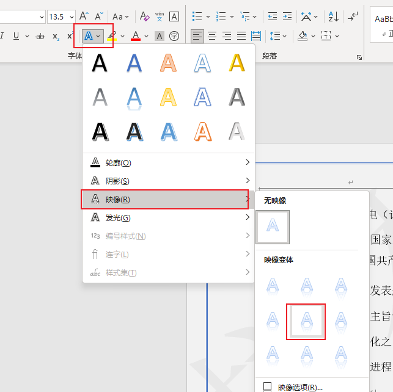
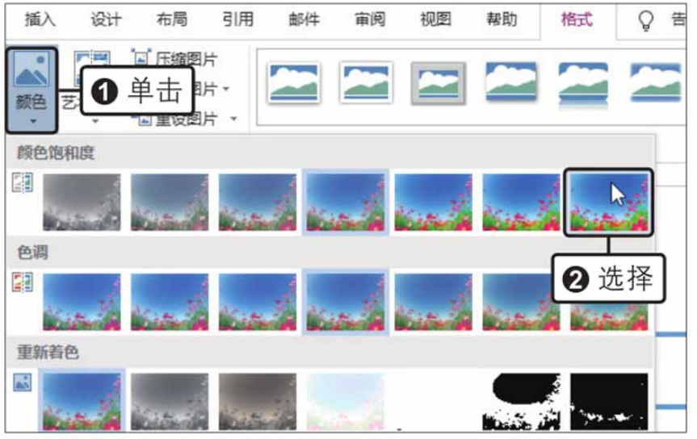
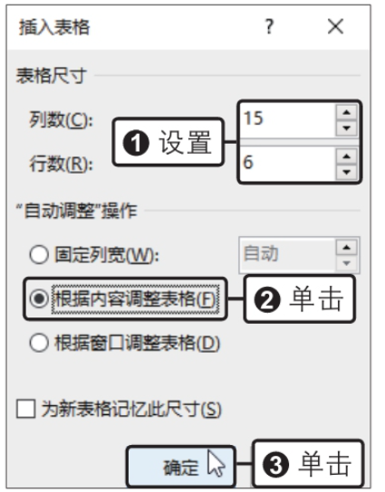

# Word文档

​		使用word文档可以方便地记录文本内容，并能够根据需要设置文字的样式，从而制作总结报告、租赁协议、请假条、邀请函、思想汇报等各类说明性文档。

## 1. 认识word工作界面

​		Word主要用于完成文字处理和文档编排工作，它主要由标题栏、功能区、快速访问工具栏、用户编辑区等部分构成，具体如下图：

| 序号 | 名称           | 功能                                                         |
| ---- | -------------- | ------------------------------------------------------------ |
| 1    | 快速访问工具栏 | 用于设置常用的按钮，如“撤销”、“保存”等。                     |
| 2    | 标题栏         | 用于显示当前文档的名称                                       |
| 3    | 窗口控制按钮   | 可对当前窗口进行最大化、最小化及关闭等操作，以及控制功能区的显示方式 |
| 4    | 选项卡         | 显示各个功能区的名称                                         |
| 5    | 功能区         | 包含大部分的功能按钮，并分组显示，方便用户使用               |
| 6    | 标尺           | 用于手动调整页边距或表格列宽等。                             |
| 7    | 用户编辑区     | 用于输入和编辑文档内容                                       |
| 8    | 状态栏         | 用于显示当前文档的信息                                       |
| 9    | 视图按钮       | 单击其中第一按钮可切换至相应的视图                           |
| 10   | 显示比例       | 用于更改当前文档的显示比例                                   |

> 使用小技巧：
>
> ​		我们在日常使用当中，可以在“视图”选项卡下的“显示”组中取消勾选“标尺”复选框，隐藏掉标尺。当我们需要使用的时候再去勾选即可。

## 2. Word的基本操作

### 2.1 插入日期和时间

​		日期和时间是我们经常会在文本里输入的数据之一，在word当中可以使用“日期和时间”对话框插入当前的日期和时间。

​		操作步骤：

​			（1）单击要插入日期和时间的位置

​			（2）点击“插入”选项卡，点击里面的“日期和时间”按钮，如下图：

​			（3）在新弹出的对话框当中，语言选择为“中文（中国）”，之后在左侧的可用格式当中选择需要的格式，之后点击下面的确定可以了。

​		当我们需要大量插入日期和时间的时候，我们还可以通过组合键快速的插入，如果想要插入的是系统当前的日期和时间，我们可以按[ Alt+Shift+D]组合键输入当前日期；按[ Alt + Shift + T ]组合键，输入当前时间。

### 2.2 输入符号

​		符号是具有某种特定意义的标识。能够直接从键盘输入的符号有限，我们可以通过“符号”对话框输入各种各样的符号。

​		我们在“插入”选项卡，单击“符号”按钮，在展开的列表中选择“其他符号”选项，如下图所示，之后会弹出一个“符号对话框”。

​		我们在这个对话框当中可以选择字体并且在下面的符号当中进行选择，如果这里并没有我们想要使用的符号，还可以选择上面的“特殊字符”选项卡，选中想要的符号之后，点击插入即可。

### 2.3 加密文档

​		为了保护文档，可以设置文档的访问权限，防止无关人员访问文档，也可以设置文档的修改权限，防止文档被恶意修改。

​		我们只需要在原始文件当中，在“文件”菜单中单击“信息”命令之后，在右侧的面板中单击“保护文档”按钮，在展开的下拉列表中单击“用密码进行加密”选项，如下图所示。

​		之后会弹出一个“加密文档”对话框让我们输入密码，当我们输入完成之后，单击确定按钮。

​		点击确定按钮之后，还会再弹出一个“确认密码”窗口，让我们再一次输入密码，输入后再次单击确定按钮就可以了。这时该文档就必须输入密码之后才能查看了。

​		当我们想取消文档的密码时，需要打开文档后，“文件>信息”命令，在右侧的面板中单击“保护文档>用密码进行加密”选项，在弹出的“加密文档”对话框中删除密码，单击确定即可。

### 2.4 设置文档的修改权限

​		当我们想要文档允许其他人查看，但是不允许被其他修改的时候，我们可以设置修改权限。

​		设置步骤如下：

​		（1）限制编辑

​		打开原始文件，切换到“审阅”选项卡，单击“保护”组中的“限制编辑”按钮，如下图所示：

​		（2）启动强制保护

​		打开“限制编辑”窗格，在“编辑限制”选项组下勾选“仅允许在文档中尽显此类别的编辑”复选框，设置编辑限制为“不允许任何更改（只读）”，单击“是，启动强制保护按钮”，如下图所示

​		（3）输入密码

​		弹出“启动强制保护”对话框，在“新密码”文本框中输入一个密码，之后在“确认新密码”文本框再次输入一次之后单击“确定”按钮。

​		

### 2.5 朗读文档

​		Word当中现在带有了朗读工具，可以将文档中的文本使用内置的语音引擎朗读出来，还可以控制朗读的速度和声音。

​		使用步骤如下：

​		（1）启动朗读工具

​		打开原始文件，将光标定位至要开始朗读的位置，在“审阅”选项卡下的“语音”组中单击“朗读”按钮。

​		

​		（2）收听朗读效果

​		此时可听到朗读效果。文档编辑区的右上角会出现一个播放控制条，并且在朗读过程中会突出显示正在朗读的内容，如下图所示

​		（3）调整朗读速度

​		单击播放控制条中的“设置”按钮，在展开的列表中拖动“阅读速度”下的滑块，可以调节朗读的速度，并且我们开可以在“语音选择”下拉列表框中切换朗读的声音，如下图所示。

## 3. 文档的排版与美化

### 3.1 设置页面布局

#### 3.1.1 设置纸张大小和方向

​		当文档中的文本内容不满一页的时候，可以对文档的纸张大小和方向稍微做修改，使整个版面看起来更加饱满。

​		（1）单击“其他纸张大小”选项

​		打开原始文件，切换到“布局”选项卡，在“页面设置”组中单击“纸张大小”按钮，在展开的列表中单击“其他纸张大小”选项，如下图所示。

​		（2）设置纸张大小

​		弹出“页面设置”对话框，在“纸张大小”选项组中使用数值调节按钮设置纸张的“宽度”为“14厘米”、“高度”为“15厘米”，如下图所示。

​		（3）查看设置纸张大小的效果

​		单击“确定”按钮，返回到文档中，可以看见设置纸张大小的效果，如下图所示。

​		（4）设置纸张方向

​				在“页面设置”组中单击“纸张方向”按钮，在展开的列表中单击“横向”选项，如下图所示。

​		（5）设置文本方向

​		在Word中除了能更改纸张方向，还能更改文本方向。选择需要更改方向的文本，在“布局”选项卡下单击“文字方向”按钮，在展开的下拉列表中单击需要的选项即可，包括设置为“水平”，“垂直”，“将所有文字旋转90°”，“将所有文本旋转270°”及自定义文本方向。

#### 3.1.2 设置页边距

​		打开原始文件，切换到“布局”选项卡，单击“页面设置”组中的“页边距”按钮，在展开的列表中单击“窄”选项，如下图：

#### 3.1.3 设置页面背景

​		设置文档的页面背景，主要是为了创建一些更有趣味的文档。设置页面背景包括给页面添加水印、设置页面的颜色和边框等。

​		**设置水印**

​		（1）选择水印样式

​		打开原始文件，在“设计”选项卡下的“页面背景”组中单击“水印”按钮，在展开的库中选择“样本1”样式，如下图所示。

​		**设置页面颜色**

​		在“页面背景”组中单击“页面颜色”按钮，在展开的颜色库中选择页面颜色为“白色，背景1，深色5%”，如下图所示。

​		**设置“页面边框”按钮**

​		设置了页面背景中的水印和颜色后，还可以对页面边框进行设置。在“页面背景”组中单击“页面边框”按钮，如下图所示。

​		之后在弹出“边框和底纹”对话框，在“页面边框”选项卡的“设置”选项组中单击“三维”选项，在“样式”列表框中单击双实线，设置边框“颜色”为深蓝色，“宽度”为0.5磅。

​		当点击“确定”按钮之后我们的界面就会如下图所示。

​		

​		**设置图片背景**

​		如果我们想要使用图片卓伟页面背景，只需要在“页面背景”组中单击“页面颜色”按钮，在展开的下拉列表中单击“填充效果”选项，在弹出的对话框中切换至“图片”选项卡，单击“选择图片”按钮，在“插入图片”对话框中选择并插入图片，单击“确定”按钮即可。

### 3.2 设置字体格式

#### 3.2.1 设置字体、字号和颜色

​		**设置字体**

​		打开原始文件，选择文档的内容，在“开始”选项卡下单击“字体”组中“字体”右侧的下三角按钮，在展开的下拉列表中单击想要设置的字体选项，如下图所示。

​		**设置字号**

​		在“字体”组中单击“字号”右侧的下三角按钮，在展开的下拉列表中单击想要设置的字号选项，如下图所示。

​		**设置字体颜色**

​		在“字体”组中单击”字体颜色“右侧的下三角按钮，在展开的颜色库中选择想要设置的颜色选项，如下图所示。

> 在word当中，除了可以在“字体”组中设置文本的字体、字号和颜色，还可以通过对话框来设置。
>
> 在“开始”选项卡下的“字体”组中单击对话框启动器，打开“字体”对话框，在“字体”选项卡下即可设置字体、字号和颜色如下图所示。
>
> 

#### 3.2.2 设置字形

​		为了突出显示文档中的某些文本内容，可以为这些内容设置不同的字形，如将字体加粗或为字体添加下划线等。

​		**加粗字体**

​		打开原始文件，选择“指定的使用者”文本内容，在“开始”选项卡下单击“字体”组的“加粗”按钮如下图所示。

​		**添加下划线**

​		将字体加粗后，在“字体”组中单击“下划线”按钮，如下图所示。

#### 3.2.3 设置文本效果

​		使用“文本效果”功能可为文本添加映像、阴影、轮廓、发光等效果，从而美化或突出文本。

​		**选择映像映像**

​		打开原始文件，选择文档内容，在“字体”组中单击“文本效果和版式”按钮，在展开的下拉列表中一次单击“映像>半映像：4磅偏移量”选项，如下图所示。

#### 3.2.4 设置字符间距、文本缩放和位置

​		设置字符间距，可以改变两个文本之间的距离，使文本变得更紧凑或更稀疏；设置文本缩放，可以在保持文本高度不变的同时改变文本的宽度；设置字符的位置，可以将文本显示在同行的上方或下方等。

​		**设置字符间距**

​		打开原始文件，选择“切断电源”文本内容，在“字体”组中单击对话框启动器，如下图所示

​		在弹出“字体”对话框，切换到“高级”选项卡，在“字符间距”选项组中设置“缩放”为“150%”、“间距”为“加宽”、“磅值”为“0.5磅”，单击“位置”右侧的下三角按钮，在展开的列表中单击“上升”选项，如下图所示。

#### 3.2.5 设置字符边框

​		文档中的文本也是可以添加边框的。

​		**添加字符边框**

​		打开原始文件，选择“网络”文本内容，在“字体”组中单击“字符边框”按钮，如下图所示。

#### 3.2.6 设置字符底纹

​		为文本添加底纹，可以突出显示文本。选择文本后，通过“开始”选项卡下“字体”组中的“字符底纹”按钮可快速为文本添加灰色底纹。

​		**添加字符底纹**

​		打开原始文件，选择要添加底纹的文本内容，在“字体”组中单击“字符底纹”按钮，如下图所示。

### 3.3 设置段落格式

​		设置段落格式包括设置段落的对齐方式、设置段落缩进和段落间距、为段落添加项目符号和编号、为段落应用多级列表等内容。

#### 3.3.1 设置段落对齐方式

​		段落的对齐方式分为5种，分别为左对齐、居中、右对齐、两端对齐和分散对齐。

​		**选择对齐方式**

​		打开原始文件，选择文档的标题，在“开始”选项卡下的“段落”组中单击“居中”按钮，如下图所示。

#### 3.3.2 设置段落缩进格式与段落间距

​		段落缩进可以改变段落左侧和右侧与页边距的距离，而设置段落间距包括设置段与段之间的距离及段落中每一行之间的距离。

​		**设置段落格式**

​		打开原始文件，选择所有的正文内容，在“开始”选项卡下单击“段落”组中的对话框启动器，如下图所示。

​		弹出“段落”对话框，在“缩进”选项组中设置段落的“特殊格式”为“首行缩进”、“缩进值”为“2字符”，在“间距”选项组中设置“行距”为“1.5倍行距”,如下图所示。

#### 3.3.3为段落应用项目符号

​		项目符号可以用于标记段落。在为段落添加项目符号时，既可以选择预设的项目符号，也可以自定义项目符号，例如使用图片作为项目符号，添加到需要的段落之前。

​		**（1）选择项目符号**

​		打开原始文件，选择需要应用项目符号的段落，在“段落”组中单击“项目符号”右侧的下三角按钮，在展开的样式库中选择菱形符号，如下图所示。

​		**（2）定义新项目符号**

​		将光标定位在标题前，单击“项目符号”右侧的下三角按钮，在展开的下拉列表中单击“定义新项目符号”选项，如下图所示。

​		在弹出“定义新项目符号”对话框，单击“图片”按钮，如下图所示。

​		弹出“插入图片”对话框，在“必应图像搜索”文本框中输入“文具”，单击“搜索”按钮，在搜索结果中选择需要的图片，单击“插入”按钮，如下图所示。

### 3.4 分栏排版

​		将文本拆分为两列或多列，即为分栏排版，例如杂志中一个页面的内容分两列或三列排列。

​		设置文档分栏时，不仅可以选择分栏的栏数，还可以在栏与栏之间添加分隔线。

#### 3.4.1设置分栏

​		打开原始文件，选择整个文档内容，切换到“布局”选项卡，单击“页面设置”组中的“栏”按钮，在展开的下拉列表中单击“更多栏”选项，如下图所示

​		弹出“栏”对话框，选择“预设”选项组下的“两栏”图标，勾选“分隔线”复选框，单击“确定”按钮木如下图所示。

#### 3.4.2 设置通栏标题

​		设置通栏标题是指不管正文的内容以多少栏显示，标题行总显示在页面的居中位置。

​		**设置分栏**

​		打开原始文件，选择文档标题，切换到“布局”选项卡，单击“页面设置”组中的“栏”按钮，在展开的下拉列表中单击“一栏”选项，如下图所示。

### 3.5 设置特殊版式

​		特殊版式包括首字下沉和中文版式两类。

#### 3.5.1 首字下沉

​		首字下沉的方式分为下沉和悬挂，用户可以根据实际需求选择合适的下沉方式。设置首字下沉时，还可以设置下沉文本的字体和下沉行数等，

​		**（1）设置下沉**

​		打开原始文件，选择第一段段首的文字，切换到“插入”选项卡，单击“文本”组中的“首字下沉”按钮，在展开的下拉列表中单击“首字下沉选项”选项，如下图所示。

​		弹出“首字下沉”对话框，在“位置”选项组中单击“下沉”选项，设置“字体”为“楷体”、“下沉行数”为“2”、“距正文”为“0.5厘米”，单击“确定”按钮，如下图所示。

### 3.6 为文档添加页眉和页脚

​		页眉和页脚通常用于展示文档的附加信息，如日期、页码、单位名称等。

#### 3.6.1 选择要使用的页眉样式

​		word组件提供了多种页眉样式，用户可以在“页眉”下拉列表中选择喜欢的样式插入到文档中生成页眉。

​		**（1）选择页眉样式**

​		打开原始文件，切换到“插入”选项卡，单击“页眉和页脚”组中的“页眉”按钮，在展开的下拉列表中单击“奥斯汀”选项，如下图所示。

​		**（2）查看添加页眉的效果**

​		此时可以看见在页面的顶端添加了页眉，并在页眉区域显示“文档标题”的文档部件，如下图所示。

> 我们该如何去除页眉中的横线？
>
> 在文档中添加页眉后，会发现页眉内容下方有一条横线，当删除页眉内容后，该条却没有消失。若不希望显示这条横线，可以将光标定位至页眉的段落标记前，在“开始”选项卡下单击“字体”组中的“清除所有格式”按钮，再关闭页眉页脚视图，页眉的横线就消失了。

#### 3.6.2 编辑页眉和页脚内容

​		在一个已经添加了页眉和页脚的文档中，如果要编辑页眉和页脚，需要先将页眉和页脚切换到编辑状态。

​		**（1）编辑页眉**

​		打开原始文件，切换到“插入”选项卡，单击“页眉和页脚”组中的“页眉”按钮，在展开的列表中单击“编辑页眉”选项，如下图所示。

​		**（2）输入页眉文本**

​		此时页眉呈编辑状态，在页眉的“标题”文档部分中输入页眉的内容为“成功人士心理学”，如下图所示。

​		**（3）输入页脚**

​		按键盘上的向下方向键，切换至页脚区域，输入页脚的内容为“2018年3月培训课题”，如下图所示。

#### 3.6.3 为文档插入页码

​		页码是每一个页面上用于标明页面次序的数字，可以参考下面的步骤为文档插入页码。

​		**（1）选择页码样式**

​		将光标定位在插入页码的位置，切换到“插入”选项卡，单击“页眉和页脚”组中的“页码”按钮，在展开的下拉列表中单击“当前位置”选项，在级联列表中选择页码的样式为“双线条”，如下图所示。

### 3.7 使用分隔符划分文档内容

​		分隔符可以用于标识文本分隔的位置，在文档中常用的分隔符为分页符和分节符，即将文档分成多页或多节。

#### 3.7.1 使用分页符分页

​		分页符可在文档的任意位置强制分页，使分页符之后的内容转到新的一页。

​		**（1）使用分页符**

​		打开原始文件，将光标定位在需要分页的位置，切换到“布局”选项卡，单击“页面设置”组中的“分隔符”按钮，在展开的下拉列表中单击“分页符”选项，如下图所示。

#### 3.7.2 使用分节符分节

​		分节符的作用是把文档分成几个节，可以在同一页中插入节并开始新节，也可以在当前页面插入分节符后在下一页开始新节。

​		**（1）选择分节符类型**

​		打开原始文件，将光标定位在第一段末尾，切换到“布局”选项卡，单击“页面设置”组中的“分隔符”按钮，在展开的下拉列表中单击“分节符”选项组中的“连续”选项，如下图所示。

​		**（2）查看使用分节符的效果**

​		此时可以看见插入分节符的位置出现了一个新的空白段落，使段落与段落之间分离开来，将光标定位在“主管同意”文本内容之后，如下图所示。

​		**（3）再次使用分节符**

​		再次单击”分隔符“下拉列表中的”连续“选项，此时可以看到，光标后的文本被分离到了下一个段落中。使用同样的方法继续对文档中的其他内容进行适当的分节，如下图所示。

## 4. 制作图文并茂的文档

​		一份文档如果仅有文本，难免显得单调。在word中，可以应用文本框、图片、自选图形、图标、艺术字、SmartArt图形、数据图表等来辅助文本表达、丰富文档内容、美化页面效果，制作初图文并茂的文档。

### 4.1 插入文本框

​		Word中的文本框是一种可移动、可调大小的文本或图形容器。使用文本框可以在一页上房子数个文本块，或使文本按与文档中其他文本不同的方向排列。

​		**（1）选择我文本框样式**

​		新建空白文档，切换到“插入”选项卡，单击“文本”组中的“文本框”按钮，在展开的样式库中选择“奥斯汀引言”样式，如下图所示。

​		**（2）查看插入文本框的效果**

​		此时在文档的最上方插入一个样式为“奥斯汀引言”的文本框，文本框自动被选中，如下图所示。

### 4.2 添加图片和图形

​		为了使文档内容更加丰富多彩，可以在文档中插入一些图片和图形。特别是在制作简报或宣传文档时，图片和图形可以起到很好的装饰作用。

#### 4.2.1 插入与编辑本机图片

​		通常来说，插入图片是指插入计算机中存储的图片文件。这些图片也许并不能完全满足用户的需求，所以插入后可对图片做出适当的调整。

​		**（1）插入图片**

​		打开原始文件，将光标定位在要插入图片的位置，切换到“插入”选项卡，单击“插入” 选项卡，单击“插图”组中的“图片”按钮，如下图所示。

​		**（2）选择图片**

​		弹出“插入图片”对话框，找到图片保存的位置，选择图片，单击“插入”按钮，如下图所示。

​		**（3）更改图片颜色**

​		单击图片将其选中，切换到“图片工具-格式”选项卡，单击“调整”组中的“颜色”按钮，在展开的颜色样式库中选择“饱和度：400%”,如下图所示。

​		**（4）更改图片样式**

​		在“图片样式”组中单击快翻按钮，在展开的图片样式库中选择“映像圆角矩形”，如下图所示。

​		**（5）柔化图片的边缘**

​		在“图片样式”组中单击“图片效果”按钮，在展开的下拉列表中依次单击“柔化边缘>10磅”选项，如下图所示。

### 4.3 插入艺术字

​		艺术字是一种富于创意性、美观性和修饰性的特使文本，一般应用于文档的标题或文档中需要修饰的内容。艺术字通常都是包含在一个文本框中的。

​		**（1）选择艺术字类型**

​		打开原始文件，切换到“插入”选项卡，单击“文本”组中的“艺术字”按钮，在展开的艺术字样式库中选择合适的样式，如下图所示。

​		**（2）插入艺术字效果**

​		此时在文档中插入了一个艺术字文本框，在文本框中包含提示文本“请在此放置您的文字”，如下图所示。

​		**（3）输入文本**

​		根据需要再文本框中输入文本内容“公司人员组织结构图”。

​		**（4）为文本框应用形状样式**

​		切换到“绘图工具-格式”选项卡，单击“形状样式”组中的快翻按钮，在展开的样式库中选择合适的样式，如下图所示。

​		**（5）更改文本框形**

​		在“插入形状”组中单击“编辑形状”按钮，在展开的下拉列表中单击“更改形状”选项，在展开的形状库中选择“矩形：棱台”，如下图所示。

​	

### 4.4 插入SmartArt图形

​		SmartArt图形是一种文本和形状相结合的图形，它能以可视化的方式直观地表达出信息之间的关系。在日常工作中SmartArt图形主要用于制作流程图、组织结构图等。

​		**（1）选择SmartArt图形**

​		打开原始文件，切换到“插入”选项卡，单击”插图“组中的”SmartArt“按钮，如下图所示。

​		**（2）选择图形类型**

​		弹出“选择SmartArt图形”对话框，在左侧单击“层次结构”选项，在右侧的面板中单击“组织结构图”，如下图所示。

​		**（3）输入文本内容**

​		分别选择SmartArt图形中的形状，输入相应的文本内容，如下图所示。

​		**（4）添加形状**

​		选择包含“行政经理”的形状，右击鼠标，在弹出的快捷菜单中依次单击“添加形状>在后面添加形状”命令，如下图所示。

### 4.5 添加数据图表

​		在文档中添加数据图表能帮助就那些数据的分析。如果想让图表看起来更美观，还可以对图表的布局、样式、颜色等做出调整。

#### 4.5.1 插入图表

​		插入图表时应该根据分析数据的需要来选择适合的图表类型。Word当中的图表类型有很多，其中常用的有柱形图、折线图和饼图等。

​		**（1）插入图表**

​		打开原始文件，切换到“插入”选项卡，单击“插图”组中的“图表”按钮，如下图所示。

​		**（2）选择图表类型**

​		弹出“插入图表”对话框，在左侧单击“柱形图”选项，在右侧的选项面板中双击“簇状柱形图”选项，如下图所示。

​		此时插入了一个“簇状柱形图”图表，并自动打开了一个Excel工作簿，如下图所示。

## 5. 在文档中合理使用表格

​		表格是指按项目画成的格子，在格子中可填写文本，是组织和整理信息的一种常用手段。在Word文档中使用表格来呈现内容，能够获得简洁、清晰、有序的版面效果。Word提供了丰富的表格制作功能，让用户能够轻松完成表格的创建和美化。

### 5.1 创建表格

​		要使用表格来表达内容，首先就需要学会创建表格。在Word文档中创建表格的方法有三种，分别为利用表格模板插入表格、手动绘制表格、利用对话框插入表格。

#### 5.1.1 利用模板插入表格

​		利用表格模板来插入表格可以说是最常用的一种方法，但是，这种方法存在一定的局限性，因为表格模板最多只能创建8行10列的表格。

​		**（1）插入表格**

​		打开原始文件，将光标定位在需要插入表格的位置，切换到“插入”选项卡，单击“表格”组中的“表格”按钮，在展开的表格模板中查看插入表格的效果选择表格的行列为“4X4”，如下图所示。

​		**（2）输入内容**

​		 根据需要再表格中输入文本，即完成表格的创建，如下图所示。

#### 5.1.2 利用对话框插入表格

​		利用对话框可以在创建表格之前设定好表格的尺寸、列宽等，快速创建满足要求的表格。

​		**（1）单击“插入表格”选项**

​		打开原始文件，定位好光标，单击“表格”组中的“表格”按钮，在展开的下拉列表中单击“插入表格”选项，如下图所示。

​		**（2）设置表格的尺寸**

​		弹出“插入表格”对话框，设置表格的“列数”为“15”、“行数”为“6”，单击“根据内容调整表格”单选按钮，单击“确定”按钮，如下图所示。

​		**（3）输入内容**

​		根据需要再表格中输入文本，表格中的单元格大小自动和文本内容的长度相匹配，如下图所示。

#### 5.1.3 绘制斜线表头

​		制作表格时，有时候标题栏徐英浩用斜线来区分两个标题的指向，这时候就需要使用手动绘制表格的功能绘制一条斜线，制作斜线表头。

​		**（1）单击“绘制表格”选项**

​		打开原始文件，单击“表格”组中的“表格”按钮，在展开的下拉列表中单击“绘制表格”选项，如下图所示。

​		**（2）绘制斜线**

​		在需要绘制斜线的单元格中斜向拖动鼠标，绘制斜线，如下图所示。释放鼠标后，可以查看绘制的效果。

### 5.2 编辑表格

​		在文档中创建表格后，巍峨满足输入文本内容的需要，可以对表格进行编辑。表格的编辑操作一般包括在表格中插入行和列、对单元格进行合并和拆分、调整行高和列宽、调整表格的对齐方式等。

#### 5.2.1 在表格中插入行和列

​		插入表格时，也许无法准确预估需要的行数和列数。在表格中添加文本内容时，如果表格中的行或者列不够用，可以插入新的行或者列。

​		**（1）插入行**

​		打开原始文件，将光标定位在需要再其下方插入行的单元格中，切换到“表格工具-布局”选项卡，单击“行和列”组中的“在下方插入”按钮，如下图所示。

​		**（2）插入列**

​		将光标定位在需要在其右侧插入列的单元格中，在“行和列”组中单击“在右侧插入”按钮，如下图所示。

#### 5.2.2 合并和拆分单元格

​		调整表格的格式时，有时会需要合并和拆分单元格。合并单元格即将多个相邻的单元格合并为一个单元格，而拆分单元格则是将一个单元格拆分为多个单元格。

​		**（1）合并单元格**

​		打开原始文件，选择要合并的多个相邻单元格，切换到“表格工具-布局”选项卡，单击“合并”组中的“合并单元格”按钮，如下图所示。

​		**（2）拆分单元格**

​		将光标定位在需要拆分的单元格中，单击“合并”组中的“拆分单元格”按钮，如下图所示。

​		**（3）设置拆分的列数和行数**

​		弹出“拆分单元格”对话框，设置“列数”为“1”、“行数”为“2”，单击“确定”按钮，如下图所示。

> 表格跨页时自动重复表格标题
>
> 编辑表格时难免会遇到表格跨页的情况，由于下一页的表格缺少标题，查看起来很不方便，手工添加标题又显得不够灵活，如果表格的标题位于第一行，可以将光标定位至第一行中，在“表格工具-布局”选项卡下单击“重复标题行”按钮，即可在下一页表格中自动重复显示第一行的标题。

### 5.3 美化表格

​		运用前面学习的操作搭建好表格的框架并输入内容后，还需要对表格样式进行适当的设置，才能得到一个专业、美观的表格。Word中有丰富的预设表格样式，可以直接套用，如果对预设的表格样式不满意，还可以通过自定义表格的边框和底纹来美化表格。

#### 5.3.1 设置表格边框与底纹

​		在设置表格边框时可以选择不同的线条样式，还可以调整边框的颜色和粗细。给表哥添加底纹时，也可以根据实际情况选择合适的颜色。

​		**（1）选择边框样式**

​		打开原始文件，将光标定位在表格中的任意位置，切换到“表格工具-设计”选项卡，单击“边框”组中的“笔样式”右侧的下三角按钮，在展开的样式库中选择合适的边框样式，如下图所示。

​		**（2）选择笔颜色**

​		在“边框”组中单击“笔颜色”下三角按钮，在展开的颜色库中选择“红色”，如下图所示。

​		**（3）绘制边框**

​		选择好边框的样式和颜色后，可看见鼠标指针呈画笔形，单击要设置边框的表格线，如下图所示。

​		**（4）绘制完所有边框**

​		采用同样的方法给表格绘制不同的边框，如下图所示。

​		**（5）选择底纹颜色**

​		选择要添加底纹的单元格区域，在“表格样式”组中单击“底纹”下三角按钮，在展开的颜色库中选择“橙色，个性色6，淡色80%”，如下图所示。

